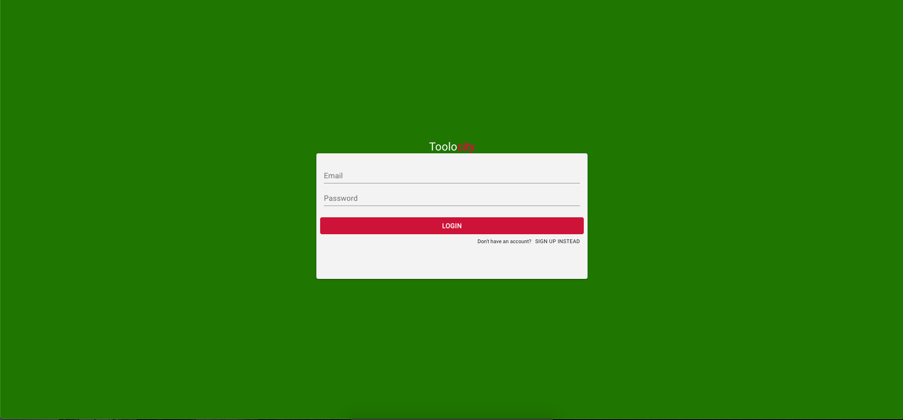
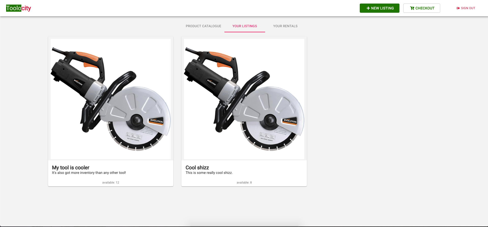

# Toolocity

## https://project3js.herokuapp.com/

##### https://surielsa.github.io/Project3/

### Our Concept

This app is a marketplace for renting power tools and heavy duty equipment. The mission is to allow commercial contractors to rent tools from hardware stores and each other  and have them delivered as soon as possible by a third party deliverer like in Uber Eats or GrubHub. This app will provide a clear listing of available power tools per category and via  geolocation.  This app to work with hardware stores first to deliver equipment to commercial contractors if their equipment fails. This will first be offered to commercial account holders, then possibly expanded.  Future hopes for the app are that it will show tool listings based off of certain commercial users. Essentially you will be able to look at everyone’s “toolbox.”Perfect for commercial contractors to get tools when their tools fail on the job or they need a tool they do not have and do not wish to purchase right away. Toolocity is a platform that enables you to securely book the tools you need at a low rate. Once you are done, just schedule the pick up so it can be returned to the store. You will only be charged the deposit until you return the tool.

### How it Works...

#### The App

The app is setup using an Express.js server, running at port (process.env.PORT) 300 by default. The app uses Postgres to build the database in the back-end. Postgres was easy to link to Heroku so that's why it was used.  We also used JWT to encrypt our user's information.

#### The Design

###### The Fron-End 

The express app uses a "create-react-app" based app, in order to simplify the process of returning a compiled React.js app, as well as supporting API routes on the same server.

In the main page there is a "login" link and an option to sign up to use the site. Also a link to view the product catalogue. 

The login screen allows you to login and view your tools and the product catalogue with tools from other users.

The product catalogue is populated by the users. The more tools the users add the more expansive the tool catalogue becomes.

New users can register to rent tools

Listings allows each user to see their toolbox

The rental page shows the checkout with the tools you have to rent out in your cart. 

