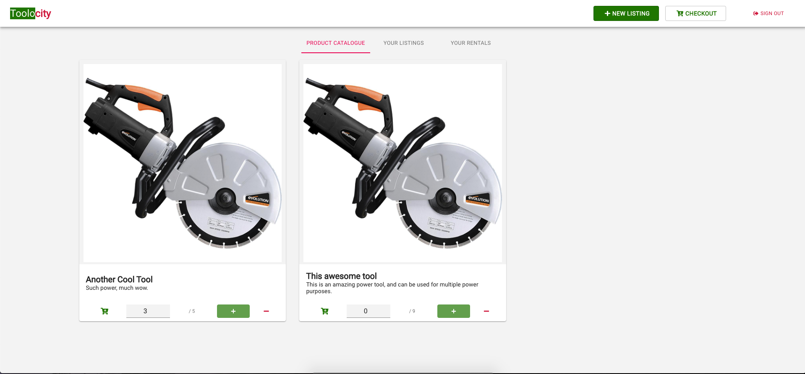

# Toolocity

https://project3js.herokuapp.com/

## Our Concept

This app will be a marketplace for renting power tools. The mission is to allow commercial contractors to rent tools from hardware stores and each other  and have them delivered as soon as possible by a third party deliverer like in Uber Eats or GrubHub. This app will provide a clear listing of available power tools per category and via  geolocation.  This app to work with hardware stores first to deliver equipment to commercial contractors if their equipment fails. This will first be offered to commercial account holders, then possibly expanded.  Future hopes for the app are that it will show tool listings based off of certain commercial users. Essentially you will be able to look at everyone’s “toolbox.”
Perfect for commercial contractors to get tools when their tools fail on the job or they need a tool they do not have and do not wish to purchase right away. Toolocity is a platform that enables you to securely book the tools you need at a low rate. Once you are done, just schedule the pick up so it can be returned to the store. You will only be charged the deposit until you return the tool.

### The Page

